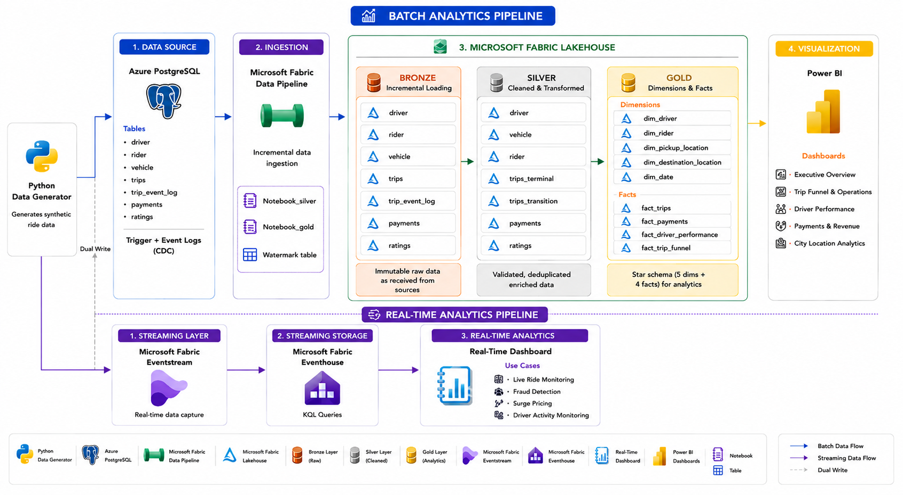

# RideX — Real-Time Ride Analytics Platform

A proof-of-concept data engineering platform that simulates a ride-hailing
system (Uber/Ola-style), and builds a complete
batch + real-time analytics pipeline on top of it — from synthetic data
generation through to Power BI dashboards.

This is a POC project demonstrating end-to-end data engineering
across simulation, operational storage, batch ETL (medallion architecture),
real-time streaming, fraud/surge detection, and BI reporting.

---

## Architecture



The platform follows two parallel paths from the same source events:

- **Cold path (batch):** Azure Database for PostgreSQL → Microsoft Fabric
  Data Pipeline (incremental, watermark-based) → Lakehouse (Bronze → Silver
  → Gold medallion layers) → Power BI (DirectQuery)
- **Hot path (real-time):** Python simulator → Fabric Eventstream (Custom
  App endpoint) → Eventhouse (KQL Database) → live KQL queries & alerts →
  Real time Dashboards

Both paths originate from the same simulated trip lifecycle, so the same
events feed historical analytics and live operational monitoring.

---

## Why this stack

| Choice | Reason |
|---|---|
| Azure PostgreSQL (not local) | Native Fabric connectivity, no on-prem gateway needed |
| Watermark-based incremental loads | Avoids full-table copies on every pipeline run |
| Medallion architecture (Bronze/Silver/Gold) | Standard separation of raw, cleaned, and analytics-ready data |
| Window functions over self-joins | Efficient single-pass computation of trip state transitions |
| Dual-write (Postgres + Eventstream) | Postgres remains source of truth; Eventstream is the hot-path side-channel, accepting minor sync drift as a reasonable POC tradeoff over full CDC (Debezium) |
| Power BI Desktop + DirectQuery | Tenant/licensing constraints blocked native Fabric workspace creation; DirectQuery against the SQL analytics endpoint was the practical path |

Decisions like CDC/Debezium and MongoDB for event logs were **deliberately
deferred** — a Postgres trigger + `trip_event_log` table provides the same
historical-transition capability with far less operational overhead, which
was judged the right tradeoff for a POC at this scale.

---

## Repository structure

```
├── Architecture/              # Architecture diagrams & design rationale
├── Data_generation/           # Python simulator: trip lifecycle, fraud injection
├── Data_pipeline/             # Fabric Data Pipeline configs (incremental copy, watermarking)
├── Database/                  # PostgreSQL schema, triggers, seed data
├── Eventhouse_and_eventstream/# Eventstream config, KQL queries, materialized views
├── Lakehouse/                 # PySpark notebooks: Bronze → Silver → Gold
└── Power Bi/                  # Semantic model notes, DAX measures, report pages
```

---

## Data model

**Operational schema (PostgreSQL):** `driver`, `rider`, `vehicle`, `trips`,
`payments`, `ratings`, `trip_event_log`

Trip status lifecycle:
```
requested → confirmed → in_progress → completed
requested → cancelled                              (no driver found)
requested → confirmed → cancelled                   (rider cancels after match)
```

Every status transition is written to `trips` (current state) **and**
appended to `trip_event_log` (full history) via a Postgres trigger —
giving the batch layer a clean way to reconstruct stage-by-stage timing
without guessing at the latest state from duplicate snapshots.

**Gold layer star schema:**

- **Facts:** `fact_trips` (terminal trips only), `fact_payments`,
  `fact_trip_funnel` (stage-transition timings), `fact_driver_performance`
  (daily pre-aggregated), `fact_ratings`
- **Dimensions:** `dim_driver` (merged with vehicle), `dim_rider`,
  `dim_pickup_location`, `dim_destination_location`, `dim_date`

`dim_pickup_location` / `dim_destination_location` are a split
role-playing dimension — both reference the same conceptual location data,
implemented as two tables for simpler Power BI relationship modeling
instead of a single table with `USERELATIONSHIP()` DAX.

---

## Real-time fraud & surge detection (KQL)

Implemented as materialized views over `trips_stream` in Eventhouse:

- Excessive cancellations by driver/rider (last 1 hour)
- Same driver-rider pair repeating too often (collusion signal, last 24h)
- Implausible trip speed (distance/duration outlier)
- Driver speed ranking
- Surge pricing ratio: live demand (`requested`) vs supply (`in_progress`)
- Cancellation rate (live)

See `/Eventhouse_and_eventstream` for full KQL definitions.

---

## Power BI report pages

1. **Executive Overview** — fleet-wide KPIs, trip status mix, revenue trend
2. **Trip Funnel & Operations** — stage drop-off funnel, time-per-stage,
   cancellation-stage breakdown
3. **Driver Performance** — leaderboard, earnings trend, rating distribution
4. **Payment & Revenue** — payment method mix, success/failure trends
5. **City & Location Analytics** — pickup density map, top routes, fare vs
   distance by zone

---

## Running the simulator

```bash
pip install psycopg2-binary faker azure-eventhub
python Data_generation/simulate_trips.py
```

Generates one full trip lifecycle (with light fraud injection, ~8% of
trips) every 2 seconds, writing to PostgreSQL and streaming each status
transition to Fabric Eventstream.

---

## Known limitations (by design, for POC scope)

- Wall-clock pacing of the simulator doesn't span real time across loop
  iterations — timestamps are realistic, but a trip's full lifecycle
  completes within a single 2-second cycle rather than genuinely spanning
  minutes of real elapsed time.
- Postgres/Eventstream dual-write can drift if one write succeeds and the
  other fails; acceptable for a POC, would need CDC for production.
- Fraud patterns are synthetically seeded (not emergent from realistic
  random behavior) to guarantee detectable signal within short demo runs.
